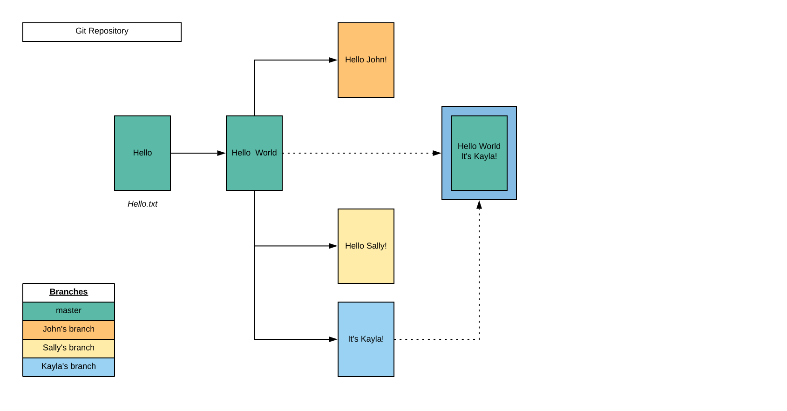

> **Git** is a version-control system for tracking changes in files and coordinating work on those files among multiple people.

**Why use version control?**
With version control you keep track of any changes to the code. If an error is made, you can roll back to a previous version of the code and you can compare previous versions of the code to correct the error and minimize disruption for other developers. Version control protects source code from catastrophes, human errors and / or unintended consequences of changes.

**Are Git and GitHub the same thing?**  
No. GitHub is a cloud-based hosting service that lets you *manage* your Git repositories. We use Git for projects, and we use GitHub to better manage them.
Github provides a solid interface for team management. You can create and manage repositories, teams, projects, and collect all issues from repositories in one place.

### Gitting to the Basics

Source: [Git for Noobs](https://www.dolthub.com/blog/2020-04-03-dolt-for-git-noobs/)  

At a high level, Git is software that allows users to manage and track all changes made to files over time. Git keeps a version of every saved change to those files. Git calls saving a version of files it stores a **commit**. Git commits make up a history of files stored in a Git **repository**. You can think of this history as a tree-like structure, where each saved version of a file is descended from another version (the previously saved version). This tree-like structure is what makes Git such a powerful tool.

Git users can "checkout" any commit in the tree, which gives them a copy of the Git repo as it existed at that commit. They can make changes to that file and save (commit) those changes. Or, they could revert all changes they made to that file by checking out the previous version.
When two different people want to edit the same files, they usually make their own branches to work on. You can think of a branch like a branch of a tree, coming off the trunk. A branch keeps each user's work separate from anyone else's changes until it's time to merge them back into the main trunk of the tree.

We can represent this idea with the following simplified illustration:  

In the diagram above, imagine we are looking at a Git repository containing the history of a single text file, called Hello.txt. The file originates on a branch named master, colored green, and this branch makes up the starting point or "trunk" of the tree. When Hello.txt was created, "Hello" was written to the file and it was saved, or commited, making it the first commit on this file's tree (a sideways tree that grows from left to right, over time).

Next, someone edited the file to add the word "World" and committed it, resulting in a new version of Hello.txt. The original version is still there, saved in the Git repository. It can always be retrieved, recovered, or restored at any time.

Next, John, Sally, and Kayla each decide to edit the file. Each one creates their own branch of the repository. These branches are represented in the picture above by the solid-line arrows stemming from the second commit in the tree. By branching, each user makes a copy of the second version of Hello.txt from branch master, meaning each user now has a copy of Hello.txt as it existed at the second commit.

Here's where things get really cool. Each user can now make whatever changes they want to the file without interfering with or affecting any other version of Hello.txt contained in the Repository. They all commit a new version. John changed his version of Hello.txt to say "Hello John!", Sally changed her version to say "Hello Sally!", and Kayla changed her's to say "It's Kayla!". As you can see, each of these differing versions is independent of the others, while still being housed in a single Git repository.
Finally, Kayla decides to merge her changes back to the master branch. This means that the master branch everyone uses will now have Kayla's changes to the file. The merge is represented by the dotted-line arrows stemming from both Kayla's version and from the master version of the file. This merging combines the two versions of Hello.txt (for our purposes magically) to make a new version of the file that reads "Hello World It's Kayla!".

It's this "merge" feature of Git that makes repository branching so powerful. The ability to merge one branch into another, combining changes made on two different versions of the Hello.txt file, is what facilitates true user collaboration. These powerful features have made Git an irreplaceable tool in many software engineering tool belts.

